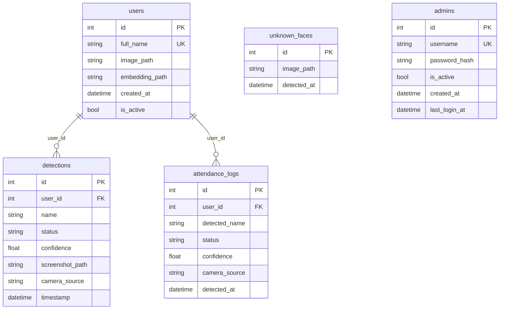

# Database Setup Guide

MySQL 8.x is the default database. SQLite is available for quick local development without Docker.

---

## Overview

| Setting | Default | Description |
|---------|---------|-------------|
| `DB_DRIVER` | `mysql` | `mysql` or `sqlite` |
| `DB_HOST` | `localhost` | MySQL host |
| `DB_PORT` | `3306` | MySQL port |
| `DB_USER` | `cctv_user` | Application user |
| `DB_PASSWORD` | *(generated)* | Application password |
| `DB_NAME` | `smart_cctv` | Database name |
| `MYSQL_ROOT_PASSWORD` | *(generated)* | Root password (Docker / admin) |

Tables are created automatically on first startup via SQLAlchemy `create_all()`.

---

## Option 1 — Docker Compose (Recommended)

### 1. Generate secrets

```powershell
copy .env.example .env
python scripts\generate_secrets.py
```

### 2. Start MySQL

```powershell
docker compose up -d
docker compose logs mysql
```

Wait for: `ready for connections`

### 3. Verify connection

```powershell
python scripts\verify_session1.py
```

Docker Compose reads credentials from `.env`:

```yaml
MYSQL_ROOT_PASSWORD: ${MYSQL_ROOT_PASSWORD}
MYSQL_DATABASE: ${DB_NAME}
MYSQL_USER: ${DB_USER}
MYSQL_PASSWORD: ${DB_PASSWORD}
```

Data persists in the Docker volume `mysql_data`.

---

## Option 2 — Native MySQL 8.x (Windows)

### 1. Install MySQL Server

Download from [dev.mysql.com/downloads/mysql](https://dev.mysql.com/downloads/mysql/).

During setup, note the root password or set one matching `.env`.

### 2. Generate and apply secrets

```powershell
python scripts\generate_secrets.py
.\scripts\secure_mysql.ps1
```

`secure_mysql.ps1` creates the database and `cctv_user` with privileges from `.env`.

### 3. Manual SQL (if script fails)

Connect as root:

```sql
CREATE DATABASE IF NOT EXISTS smart_cctv
  CHARACTER SET utf8mb4
  COLLATE utf8mb4_unicode_ci;

CREATE USER IF NOT EXISTS 'cctv_user'@'localhost'
  IDENTIFIED BY 'your_db_password_from_env';

GRANT ALL PRIVILEGES ON smart_cctv.* TO 'cctv_user'@'localhost';
FLUSH PRIVILEGES;
```

---

## Option 3 — SQLite (Development Only)

Set in `.env`:

```env
DB_DRIVER=sqlite
```

Database file: `database/smart_cctv.db` (created automatically).

> SQLite does not support concurrent writes well. Use MySQL for production or multi-user monitoring.

---

## Schema

### Entity Relationship



---

## Table Reference

### `users`

Registered persons with face photos.

| Column | Type | Notes |
|--------|------|-------|
| `id` | INT PK | Auto-increment |
| `full_name` | VARCHAR(100) UNIQUE | Display name |
| `image_path` | VARCHAR(500) | Relative path in `datasets/` |
| `embedding_path` | VARCHAR(500) NULL | Cache reference |
| `created_at` | DATETIME | Registration time |
| `is_active` | BOOLEAN | Default `true` |

### `attendance_logs`

Attendance records from live recognition (deduplicated by interval).

| Column | Type | Notes |
|--------|------|-------|
| `id` | INT PK | Auto-increment |
| `detected_name` | VARCHAR(100) | Person name or "Unknown" |
| `user_id` | INT FK NULL | Links to `users.id` |
| `detected_at` | DATETIME | Detection timestamp |
| `camera_source` | VARCHAR(200) | Webcam index or RTSP |
| `status` | VARCHAR(50) | `Recognized` or `Unknown` |
| `confidence` | FLOAT NULL | Match confidence 0–1 |

### `detections`

All detection events with optional screenshots.

| Column | Type | Notes |
|--------|------|-------|
| `id` | INT PK | Auto-increment |
| `user_id` | INT FK NULL | Known user if recognized |
| `name` | VARCHAR(100) | Detected label |
| `status` | VARCHAR(50) | `Recognized` / `Unknown` |
| `confidence` | FLOAT NULL | Match score |
| `screenshot_path` | VARCHAR(500) NULL | Path in `screenshots/` |
| `camera_source` | VARCHAR(200) NULL | Camera identifier |
| `timestamp` | DATETIME | Event time |

### `unknown_faces`

Gallery entries for unrecognized faces.

| Column | Type | Notes |
|--------|------|-------|
| `id` | INT PK | Auto-increment |
| `image_path` | VARCHAR(500) | Crop in `screenshots/unknown/` |
| `detected_at` | DATETIME | Capture time |

### `admins`

Dashboard administrator accounts.

| Column | Type | Notes |
|--------|------|-------|
| `id` | INT PK | Auto-increment |
| `username` | VARCHAR(50) UNIQUE | Login name |
| `password_hash` | VARCHAR(255) | Bcrypt hash |
| `is_active` | BOOLEAN | Default `true` |
| `created_at` | DATETIME | Account creation |
| `last_login_at` | DATETIME NULL | Last successful login |

---

## Embedding Cache

Face vectors are cached outside the database:

```
database/embeddings.pkl
```

Rebuild after adding or removing users:

```powershell
python scripts\build_embeddings.py
```

Or use **Rebuild embeddings** on the Live Monitor page.

Missing face image files are skipped with a warning in `logs/app.log`.

---

## Backup & Restore

### MySQL (Docker)

```powershell
docker exec smart-cctv-mysql mysqldump -u root -p smart_cctv > backup.sql
```

Restore:

```powershell
docker exec -i smart-cctv-mysql mysql -u root -p smart_cctv < backup.sql
```

### Files to backup

| Path | Contents |
|------|----------|
| `datasets/` | Registered face photos |
| `screenshots/` | Detection snapshots |
| `database/embeddings.pkl` | Embedding cache |
| `.env` | **Store securely — not in git** |

---

## Troubleshooting

| Problem | Solution |
|---------|----------|
| `Database unavailable after 30 attempts` | Start MySQL; check Docker health |
| `Access denied for user` | Re-run `secure_mysql.ps1` or verify `.env` passwords |
| Tables missing | Restart app — `init_db()` runs on startup |
| Old schema mismatch | Drop and recreate DB (dev only) or migrate manually |

Connection pool settings (`app/database/connection.py`):

- `pool_pre_ping=True` — reconnect stale connections
- `pool_recycle=3600` — refresh connections hourly
- `pool_size=5`, `max_overflow=10` — MySQL only

---

## Related Docs

- [Installation Guide](INSTALLATION.md)
- [API Documentation](API.md)
- [Deployment Guide](DEPLOYMENT.md)
