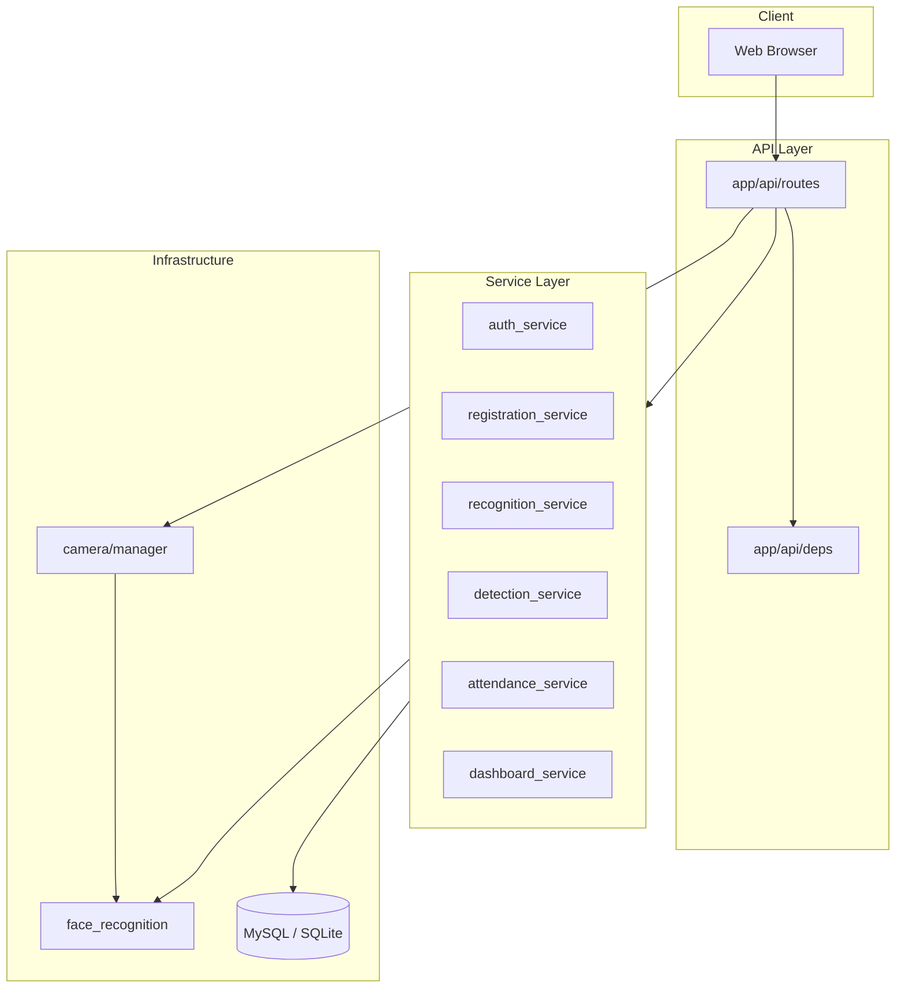
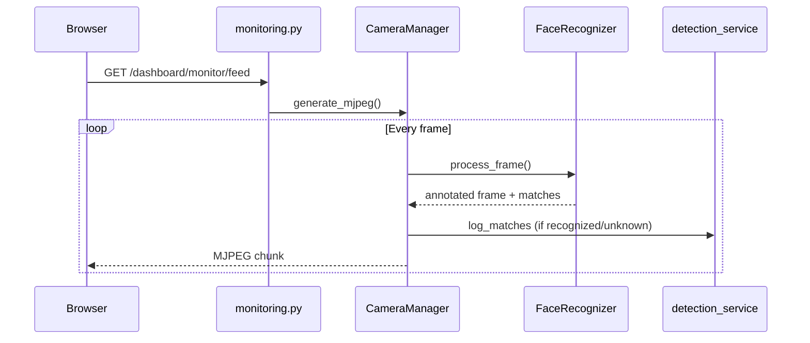

# Project Structure

Clean architecture layout separating routes, business logic, models, and infrastructure.

---

## Directory Tree

```
smart-cctv/
├── app/                          # Application package
│   ├── __init__.py               # FastAPI factory & lifespan
│   ├── api/                      # HTTP layer
│   │   ├── deps.py               # Auth dependencies
│   │   ├── exceptions.py         # Global error handlers
│   │   └── routes/
│   │       ├── auth.py           # Login / logout
│   │       ├── dashboard.py      # Dashboard pages
│   │       ├── health.py         # Health check API
│   │       ├── monitoring.py     # Live stream & camera switch
│   │       └── registration.py   # Face registration
│   ├── camera/
│   │   ├── manager.py            # Webcam / RTSP capture & MJPEG
│   │   └── frames.py             # Status frames (disconnect overlay)
│   ├── database/
│   │   ├── base.py               # SQLAlchemy declarative base
│   │   ├── connection.py         # Engine, session, get_db()
│   │   ├── errors.py             # safe_commit, rollback helpers
│   │   └── init_db.py            # wait_for_db, create_all
│   ├── face_recognition/
│   │   ├── detector.py           # Haar cascade face detection
│   │   ├── embeddings.py         # DeepFace embedding store
│   │   ├── frame_utils.py        # Resize & bbox scaling
│   │   ├── overlay.py            # Colored bounding boxes
│   │   └── recognizer.py         # Match faces to registered users
│   ├── models/                   # SQLAlchemy ORM models
│   │   ├── admin.py
│   │   ├── attendance.py
│   │   ├── detection.py
│   │   ├── unknown_face.py
│   │   └── user.py
│   ├── services/                 # Business logic
│   │   ├── attendance_service.py
│   │   ├── auth_service.py
│   │   ├── dashboard_service.py
│   │   ├── detection_service.py
│   │   ├── recognition_service.py
│   │   └── registration_service.py
│   ├── static/                   # CSS, JS, images
│   ├── templates/                # Jinja2 HTML templates
│   │   ├── auth/
│   │   └── dashboard/
│   └── utils/
│       ├── config.py             # Settings from .env
│       ├── logging.py            # File logging to logs/
│       └── templates.py          # Jinja2 environment
├── database/                     # SQLite file & embeddings cache
│   ├── smart_cctv.db             # (SQLite mode only)
│   └── embeddings.pkl            # Cached face vectors
├── datasets/                     # Registered face images
├── docs/                         # Documentation (Session 12)
├── logs/                         # app.log, errors.log
├── screenshots/                  # Detection & unknown face crops
│   └── unknown/
├── scripts/                      # Setup, verify, utility scripts
├── docker-compose.yml            # MySQL 8.0 service
├── main.py                       # Uvicorn entry point
├── requirements.txt
├── .env.example                  # Environment template
└── README.md
```

---

## Architecture Layers



---

## Layer Responsibilities

### `app/api/routes/`

HTTP handlers only. Parse requests, call services, return HTML or JSON. No business rules here.

| Module | Responsibility |
|--------|----------------|
| `auth.py` | Login form, session cookie, logout |
| `dashboard.py` | Dashboard pages (stats, users, detections) |
| `health.py` | `/api/health` JSON status |
| `monitoring.py` | Live MJPEG feed, camera switching |
| `registration.py` | Upload face image, serve dataset photos |

### `app/services/`

Business logic and orchestration. Called by routes; may use models and face_recognition.

| Module | Responsibility |
|--------|----------------|
| `auth_service.py` | Bcrypt verify, seed default admin |
| `registration_service.py` | Validate image, save to `datasets/` |
| `recognition_service.py` | Load/rebuild embedding cache |
| `detection_service.py` | Log detections, save screenshots |
| `attendance_service.py` | Attendance with cooldown dedup |
| `dashboard_service.py` | Aggregate stats queries |

### `app/models/`

SQLAlchemy ORM table definitions. One file per table group.

### `app/face_recognition/`

Computer vision pipeline — independent of HTTP layer.

| Module | Responsibility |
|--------|----------------|
| `detector.py` | Haar cascade — find face regions |
| `recognizer.py` | DeepFace match + frame skip pipeline |
| `embeddings.py` | Build/load pickle embedding store |
| `overlay.py` | Draw colored bounding boxes |
| `frame_utils.py` | Downscale frames for performance |

### `app/camera/`

Video capture abstraction. Supports webcam index, RTSP URL, Dahua RTSP builder.

### `app/utils/config.py`

Single source of truth for all settings via Pydantic `BaseSettings` reading `.env`.

---

## Request Flow — Live Monitor



---

## Data Flow — Face Registration

1. Admin uploads photo at `/dashboard/register`
2. `registration_service` validates and saves to `datasets/`
3. Row inserted in `users` table
4. `recognition_service.rebuild_embeddings()` runs DeepFace on all active users
5. Vectors cached in `database/embeddings.pkl`

---

## Key Design Decisions

| Decision | Rationale |
|----------|-----------|
| Session auth (not JWT) | Simple admin-only dashboard; cookie works with HTML forms |
| Embedding pickle cache | Avoid re-running DeepFace on every startup |
| Haar + DeepFace hybrid | Haar is fast for detection; DeepFace only on cropped faces |
| Frame skip pipeline | Keeps stream smooth on i5 Gen 4 / 8 GB RAM |
| MySQL default | Production-ready; SQLite for quick local dev |

---

## Scripts Reference

| Script | Purpose |
|--------|---------|
| `generate_secrets.py` | Generate secure `.env` passwords |
| `secure_mysql.ps1` | Apply MySQL users from `.env` |
| `build_embeddings.py` | Rebuild embedding cache CLI |
| `create_admin.py` | Add admin user interactively |
| `check_config_security.py` | Verify no secrets in git |
| `verify_session*.py` | Automated session verification |

---

## Related Docs

- [Installation Guide](INSTALLATION.md)
- [Database Setup](DATABASE.md)
- [API Documentation](API.md)
